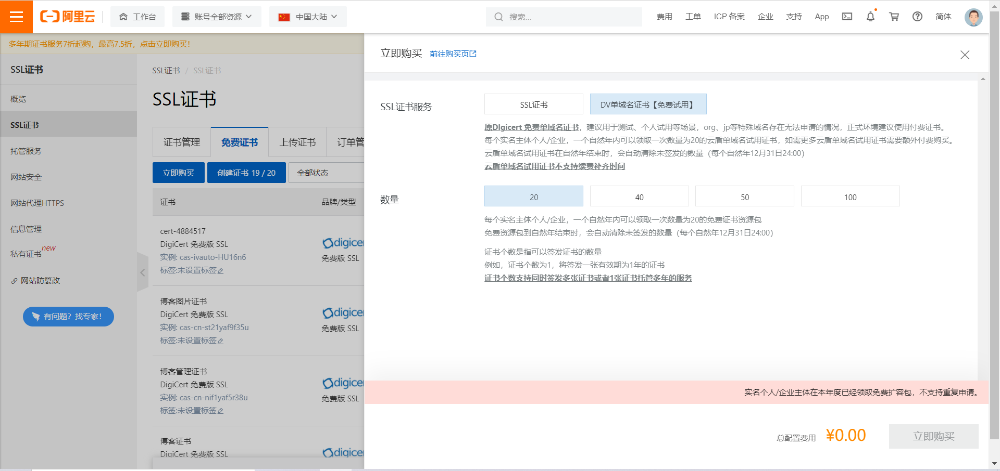
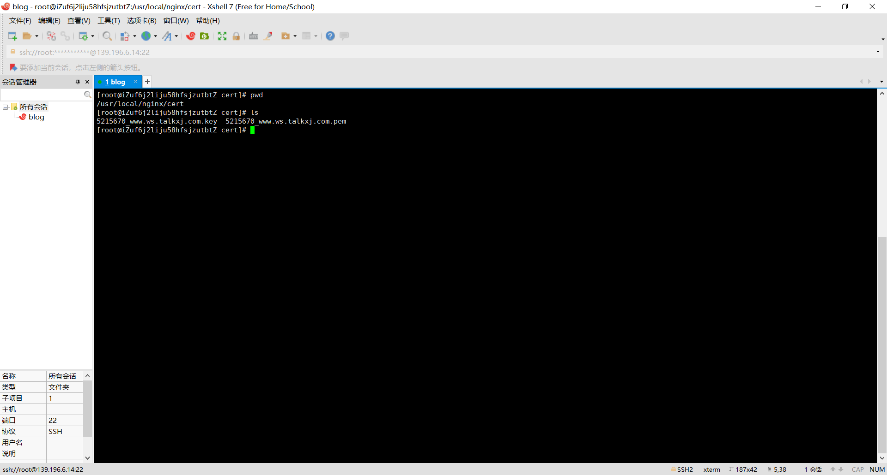

# bokeh的个人博客

项目地址：

​	blog端：http://47.109.56.28/

​	管理员端：http://47.109.56.28:8081

源码地址：https://github.com/XingYun7/bokeh-blog

来自：https://www.talkxj.com/


## 1. 项目介绍

### 1.1 技术介绍

**前端**：vue + vuex + vue-router + axios + vuetify + element + echarts

**后端**：SpringBoot + nginx + docker + SpringSecurity + Swagger2 + MyBatisPlus + Mysql + Redis + elasticsearch + rabbitMQ + MaxWell

**其他**：接入QQ，微博第三方登录


### 1.2 运行环境

**开发工具**：IDEA

**服务器**：阿里云2核4G CentOS7.6

**CDN**：阿里云全站加速

**对象存储**：阿里云OSS


### 1.3 项目总结

前端方面：UI模仿的是hexo的butterfly(原谅我不会UI设计)，加入了许多动画过渡效果，并考虑到了一些用户细节（深色模式，图片预览，代码复制等），评论加入了表情和分页，提升了用户体验。新增了留言弹幕墙，支持匿名发送弹幕。后台文章编辑器换为MarkDown，语法更加简洁，新增了草稿箱和自动保存文章等功能。

后端方面：使用Docker部署环境，更加方便快捷。采用elasticsearch做为搜索引擎，支持搜索结果分词和高亮。使用MaxWell监听mysql数据，绑定RabbitMQ消息队列同步es文章数据。接入了QQ，微博第三方登录，无需邮箱注册即可登录。

总的来说，这次升级后主流技术基本全用到了，对于学习来说是一个很不错的项目。门槛对于初学者来说稍微高了一点😂，不过我会尽量帮助大家解决问题，写文章避免大家踩坑。服务器由于使用了elasticsearch这个内存大户所以升级到了2核4G，如果是使用学生机的小伙伴可以先不用elasticsearch，用Mysql模糊查询代替。

## 2.部署环境（最低1核2G）

### 必装环境

#### 2.1 安装Docker

```shell
//安装必要工具
yum install -y yum-utils device-mapper-persistent-data lvm2
//添加docker相关的yum源
yum-config-manager --add-repo http://mirrors.aliyun.com/docker-ce/linux/centos/docker-ce.repo
//下载docker
yum install -y docker-ce
//启动docker
systemctl start docker
```

#### 2.2 安装MySQL

```shell
//下载MySQL镜像
docker pull mysql
//启动MySQL
docker run --name mysql --restart=always -p 3306:3306 -e MYSQL_ROOT_PASSWORD=密码 -d mysql
```

#### 2.3 安装Redis

```shell
//下载Redis镜像
docker pull redis
//启动Redis
docker run --name redis  --restart=always -p 6379:6379 -d redis --requirepass 密码
```

#### 2.4 安装nginx（请先部署项目再启动）

```shell
//下载nginx镜像
docker pull nginx
//启动nginx，映射本地配置文件到nginx容器文件
docker run --name nginx --restart=always -p 80:80 -p 443:443 -d -v /usr/local/nginx/nginx.conf:/etc/nginx/nginx.conf -v /usr/local/vue:/usr/local/vue -v /usr/local/upload:/usr/local/upload nginx
```

#### 2.5 安装RabbitMQ

```shell
//下载RabbitMQ镜像
docker pull rabbitmq:management
//启动RabbitMQ,默认guest用户，密码也是guest。
docker run --name rabbit --restart=always -p 15672:15672 -p 5672:5672  -d  rabbitmq:management 
```

### 选装环境（需2核4G）

#### 2.6 安装elasticsearch （可切换为MYSQL搜索）

```shell
//下载elasticsearch镜像
docker pull elasticsearch:7.9.2 
//启动elasticsearch
docker run -d --name elasticsearch -p 9200:9200 -p 9300:9300 -e "discovery.type=single-node" -e ES_JAVA_OPTS="-Xms64m -Xmx512m" elasticsearch:7.9.2 
//进入elasticsearch容器
docker exec -it elasticsearch /bin/bash 
//安装ik分词器
./bin/elasticsearch-plugin install https://github.com/medcl/elasticsearch-analysis-ik/releases/download/v7.9.2/elasticsearch-analysis-ik-7.9.2.zip
```

安装成功后使用postman创建索引


JSON参数

```json
{
    "mappings": {
            "properties": {
                "id": {
                    "type": "integer"
                },
                "articleTitle": {
                    "type": "text",
                    "analyzer": "ik_max_word"
                },
                "articleContent": {
                    "type": "text",
                    "analyzer": "ik_max_word"
                },
                "isDelete": {
                    "type": "integer"
                },
                "status": {
                    "type": "integer"
                }
            }
      }
}
```

查看索引结构


如图所示则创建成功

#### 2.7 安装MaxWell （ElasticSearch同步数据）

```shell
//下载MaxWell镜像
docker pull zendesk/maxwell 
//运行MaxWell
docker run --name maxwell --restart=always  -d  zendesk/maxwell bin/maxwell  --user='数据库用户名' --password='数据库密码'  --host='IP地址'  --producer=rabbitmq --rabbitmq_user='MQ用户名' --rabbitmq_pass='MQ密码' --rabbitmq_host='IP地址' --rabbitmq_port='5672' --rabbitmq_exchange='maxwell_exchange'  --rabbitmq_exchange_type='fanout' --rabbitmq_exchange_durable='true' --filter='exclude: *.*, include: blog.tb_article.article_title = *, include: blog.tb_article.article_content = *, include: blog.tb_article.is_delete = *, include: blog.tb_article.status = *' 
```

#### 3.容器启动成功，截图如下


#### 4.最后分享一波我常用的docker命令

```shell
docker pull xx       //下载镜像
docker rmi xx       //删除镜像
docker run xx       //运行容器
docker exec -it xx /bin/bash  //进入容器
docker rm xx        //删除容器
docker stop xx     //停止容器
docker restart xx  //重启容器
docker rename 原名 改后名  //更改容器别名
docker logs -f 容器    //查看容器日志
```


## 3.基本设置

### 3.1 搜索和上传模式

搜索模式可选elasticsearch或mysql，上传模式可选oss或local，按个人情况选择。


### 3.2 修改application中的阿里云OSS配置信息（若选OSS上传模式）

点击OSS管理 -> 点击Access Key


查看AccessKey ID和AccessKey Secret


查看bucket信息，没有则先创建


修改配置信息


**url：** 填你的bucke域名地址

**endpoint：** 填endpoint信息

**accessKeyId，accessKeySecret：** 填刚刚获取的信息

**bucketName：** 填创建的bucketName

最后OSS访问权限记得设置为公共读


**ps：如果选local上传模式请看部署文章nginx配置部分！！！**

## 4.第三方登录设置（可选）

### 4.1 打开QQ互联官网申请授权

登录后点击右上角头像 -> 个人接入


申请成功后点击应用管理创建，就能得到appId，appSecret和回调地址（一般一天左右审核成功）


### 4.2 打开微博开发者平台申请授权

申请步骤大同小异，这里直接展示结果，同样的appId，appSecret和回调地址


**ps：第三方登录回调域名最好保持一样写/oauth/login/qq和/oauth/login/weibo，如若修改需到router.js里配置OauthLogin组件路由，回调域名根据你网站的情况选择http或https。**

### 4.3 修改vue中的第三方授权信息

打开vue项目中的public的index.html文件，修改引入的js

```html
<script src="http://tjs.sjs.sinajs.cn/open/api/js/wb.js?appkey=你的微博appId" type="text/javascript" charset="utf-8"></script>
<script type="text/javascript" src="http://connect.qq.com/qc_jssdk.js" data-callback="true" data-appid="你的QQAppId" data-redirecturi="QQ回调地址" charset="utf-8"></script>
```

打开前台项目assets下的/js/config修改配置信息，填写APPID和回调地址


### 4.4 修改application中的第三方授权信息


修改appId，appSecret和回调地址即可。

**总结**：只需要修改yml提示的地方即可，不用删除和修改其他任何地方。


## 5.项目部署

### 5.1 打包后端项目jar包

打开pom.xml文件，修改packaging方式为jar


点击右侧maven插件 -> package


打包成功后会在target目录下生成jar包


### 5.2 编写Dockerfile文件

```sh
FROM openjdk:8
VOLUME /tmp
ADD blog-springboot-0.0.1.jar blog.jar       
ENTRYPOINT ["java","-Djava.security.egd=file:/dev/./urandom","-jar","/blog.jar"] 
ENV TZ=Asia/Shanghai
RUN ln -snf /usr/share/zoneinfo/$TZ /etc/localtime && echo $TZ > /etc/timezone
```

### 5.3 编写blog-start.sh脚本

```sh
#源jar路径  
SOURCE_PATH=/usr/local/docker
#docker 镜像/容器名字或者jar名字 这里都命名为这个
SERVER_NAME=blog-springboot-0.0.1.jar
TAG=latest
SERVER_PORT=8080
#容器id
CID=$(docker ps | grep "$SERVER_NAME" | awk '{print $1}')
#镜像id
IID=$(docker images | grep "$SERVER_NAME:$TAG" | awk '{print $3}')
if [ -n "$CID" ]; then
  echo "存在容器$SERVER_NAME, CID-$CID"
  docker stop $CID
  docker rm $CID
fi
# 构建docker镜像
if [ -n "$IID" ]; then
  echo "存在$SERVER_NAME:$TAG镜像，IID=$IID"
  docker rmi $IID
else
  echo "不存在$SERVER_NAME:$TAG镜像，开始构建镜像"
  cd $SOURCE_PATH
  docker build -t $SERVER_NAME:$TAG .
fi
# 运行docker容器
docker run --name $SERVER_NAME -v /usr/local/upload:/usr/local/upload -d -p $SERVER_PORT:$SERVER_PORT $SERVER_NAME:$TAG
echo "$SERVER_NAME容器创建完成"
sh
```

**ps：sh文件需要转为Unix格式**


### 5.4 将文件传输到服务器


将上述三个文件传输到/usr/local/docker下（手动创建文件夹）


### 5.5 docker运行后端项目

进入服务器/usr/local/docker下，构建后端镜像

```shell
sh ./blog-start.sh 
```


**ps：第一次时间可能比较长，耐心等待即可**

查看是否构建成功


可以去测试下接口是否运行成功


**ps：需要重新部署只需重新传jar包，执行sh脚本即可**

### 5.6 打包前端项目

打开cmd，进入Vue项目路径 -> npm run build


打包成功后会在目录下生成dist文件


将Vue打包项目传输到/usr/local/vue下（由于我前台和后台分为两个项目，所以改名dist文件）


### 5.7 nginx配置(有域名选这个)

**参考域名解析**


在/usr/local/nginx下创建nginx.conf文件，格式如下

```sh
events {
    worker_connections  1024;
}

http {
    include       mime.types;
    default_type  application/octet-stream;
    sendfile        on;
    keepalive_timeout  65;

    client_max_body_size     50m;
    client_body_buffer_size  10m; 
    client_header_timeout    1m;
    client_body_timeout      1m;

    gzip on;
    gzip_min_length  1k;
    gzip_buffers     4 16k;
    gzip_comp_level  4;
    gzip_types text/plain application/javascript application/x-javascript text/css application/xml text/javascript application/x-httpd-php image/jpeg image/gif image/png;
    gzip_vary on;

server {
        listen       80;
        server_name  前台域名;
     
        location / {		
            root   /usr/local/vue/blog;
            index  index.html index.htm; 
            try_files $uri $uri/ /index.html;	
        }
			
	location ^~ /api/ {		
            proxy_pass http://你的ip:8080/;
	    proxy_set_header   Host             $host;
            proxy_set_header   X-Real-IP        $remote_addr;						
            proxy_set_header   X-Forwarded-For  $proxy_add_x_forwarded_for;
        }
		
    }
	
server {
        listen       80;
        server_name  后台子域名;
     
        location / {		
            root   /usr/local/vue/admin;
            index  index.html index.htm; 
            try_files $uri $uri/ /index.html;	
        }
			
	location ^~ /api/ {		
            proxy_pass http://你的ip:8080/;
	    proxy_set_header   Host             $host;
            proxy_set_header   X-Real-IP        $remote_addr;						
            proxy_set_header   X-Forwarded-For  $proxy_add_x_forwarded_for;
        }
		
    }

server {
        listen       80;
        server_name  websocket子域名;
     
        location / {
          proxy_pass http://你的ip:8080/websocket;
          proxy_http_version 1.1;
          proxy_set_header Upgrade $http_upgrade;
          proxy_set_header Connection "Upgrade";
          proxy_set_header Host $host:$server_port;
          proxy_set_header X-Real-IP $remote_addr;
          proxy_set_header X-Forwarded-For $proxy_add_x_forwarded_for;
          proxy_set_header X-Forwarded-Proto $scheme;
       }
	
    }

server {
        listen       80;
        server_name  上传文件子域名;
     
        location / {		
          root /usr/local/upload/; 
        }		
		
    }
 
 }
```

**ps：我前台和后台时分为两个域名，所以写了两个server，前端项目路径为之前传输的路径，其他两个为文件上传域名和websocket转发域名。**

docker启动nginx服务

```shell
docker run --name nginx --restart=always -p 80:80 -d -v /usr/local/nginx/nginx.conf:/etc/nginx/nginx.conf -v /usr/local/vue:/usr/local/vue -v /usr/local/upload:/usr/local/upload nginx 
```

### 5.8 nginx配置(无域名选这个)

```sh
events {
    worker_connections  1024;
}

http {
    include       mime.types;
    default_type  application/octet-stream;
    sendfile        on;
    keepalive_timeout  65;

    client_max_body_size     50m;
    client_body_buffer_size  10m; 
    client_header_timeout    1m;
    client_body_timeout      1m;

    gzip on;
    gzip_min_length  1k;
    gzip_buffers     4 16k;
    gzip_comp_level  4;
    gzip_types text/plain application/javascript application/x-javascript text/css application/xml text/javascript application/x-httpd-php image/jpeg image/gif image/png;
    gzip_vary on;

server {
        listen       80;
        server_name  你的ip;
     
        location / {		
            root   /usr/local/vue/blog;
            index  index.html index.htm; 
            try_files $uri $uri/ /index.html;	
        }
			
	location ^~ /api/ {		
            proxy_pass http://你的ip:8080/;
	    proxy_set_header   Host             $host;
            proxy_set_header   X-Real-IP        $remote_addr;						
            proxy_set_header   X-Forwarded-For  $proxy_add_x_forwarded_for;
        }
		
    }
	
server {
        listen       81;
        server_name  你的ip;
     
        location / {		
            root   /usr/local/vue/admin;
            index  index.html index.htm; 
            try_files $uri $uri/ /index.html;	
        }
			
	location ^~ /api/ {		
            proxy_pass http://你的ip:8080/;
	    proxy_set_header   Host             $host;
            proxy_set_header   X-Real-IP        $remote_addr;						
            proxy_set_header   X-Forwarded-For  $proxy_add_x_forwarded_for;
        }
		
    }

server {
        listen       82;
        server_name  你的ip;
     
        location / {
          proxy_pass http://你的ip:8080/websocket;
          proxy_http_version 1.1;
          proxy_set_header Upgrade $http_upgrade;
          proxy_set_header Connection "Upgrade";
          proxy_set_header Host $host:$server_port;
          proxy_set_header X-Real-IP $remote_addr;
          proxy_set_header X-Forwarded-For $proxy_add_x_forwarded_for;
          proxy_set_header X-Forwarded-Proto $scheme;
       }
	
    }

server {
        listen       83;
        server_name  你的ip;
     
        location / {		
          root /usr/local/upload/; 
        }		
		
    }
 
 }
```

docker启动nginx服务

```shell
docker run --name nginx --restart=always -p 80:80 -p 81:81 -p 82:82 -p 83:83 -d -v /usr/local/nginx/nginx.conf:/etc/nginx/nginx.conf -v /usr/local/vue:/usr/local/vue -v /usr/local/upload:/usr/local/upload nginx 
```

**ps：需要通过ip + 端口号访问项目**

### 5.9 运行测试

去浏览器测试下是否运行成功


### 5.10 其他设置

进入后台管理 -> 系统管理 -> 网站管理 -> 其他设置，配置websocket地址，有域名则填ws://websocket域名，无域名则填ws://ip:82


## 6.全站https配置

### 1.申请ssl证书（阿里云为例）

打开阿里云控制台SSL证书应用


进入后点击SSL证书 -> 免费证书 -> 立即购买



完成后点击创建证书 -> 证书申请


填写好你的相关信息等待申请成功


申请成功后点击下载


选择nginx


下载完解压后会出现pem和key文件


### 2.将ssl文件传输到服务器上

我这里传输的路径是/usr/local/nginx/cert (没创建的需手动创建)



### 3.修改nginx配置

```sh
events {
    worker_connections  1024;
}

http {
    include       mime.types;
    default_type  application/octet-stream;
    sendfile        on;
    keepalive_timeout  65;

    client_max_body_size     50m;
    client_body_buffer_size  10m; 	  
    client_header_timeout    1m;
    client_body_timeout      1m;

    gzip on;
    gzip_min_length  1k;
    gzip_buffers     4 16k;
    gzip_comp_level  4;
    gzip_types text/plain application/javascript application/x-javascript text/css application/xml text/javascript application/x-httpd-php image/jpeg image/gif image/png;
    gzip_vary on;
	
server {

        listen  443 ssl;
        server_name  前台域名;

        ssl on;
        ssl_certificate    pem文件位置;
        ssl_certificate_key  key文件位置;
        ssl_session_timeout 5m;
        ssl_ciphers ECDHE-RSA-AES128-GCM-SHA256:ECDHE:ECDH:AES:HIGH:!NULL:!aNULL:!MD5:!ADH:!RC4;
        ssl_protocols TLSv1 TLSv1.1 TLSv1.2;
        ssl_prefer_server_ciphers on;

       location / {
            root   /usr/local/vue/blog;
            index  index.html index.htm;
            try_files $uri $uri/ /index.html;
        }
		
        location ^~ /api/ {
            proxy_pass http://你的ip:8080/;
            proxy_set_header   Host             $host;
            proxy_set_header   X-Real-IP        $remote_addr;
            proxy_set_header   X-Forwarded-For  $proxy_add_x_forwarded_for;
        }

    }

server {

        listen  443 ssl;
        server_name  后台子域名;

        ssl on;
        ssl_certificate    pem文件位置;
        ssl_certificate_key  key文件位置;
        ssl_session_timeout 5m;
        ssl_ciphers ECDHE-RSA-AES128-GCM-SHA256:ECDHE:ECDH:AES:HIGH:!NULL:!aNULL:!MD5:!ADH:!RC4;
        ssl_protocols TLSv1 TLSv1.1 TLSv1.2;
        ssl_prefer_server_ciphers on;

       location / {
            root   /usr/local/vue/admin;
            index  index.html index.htm;
            try_files $uri $uri/ /index.html;
        }
		
        location ^~ /api/ {
            proxy_pass http://你的ip:8080/;
            proxy_set_header   Host             $host;
            proxy_set_header   X-Real-IP        $remote_addr;
            proxy_set_header   X-Forwarded-For  $proxy_add_x_forwarded_for;
        }
	
    }

server {

        listen  443 ssl;
        server_name  websocket子域名;

        ssl on;
        ssl_certificate    pem文件位置;
        ssl_certificate_key  key文件位置;
        ssl_session_timeout 5m;
        ssl_ciphers ECDHE-RSA-AES128-GCM-SHA256:ECDHE:ECDH:AES:HIGH:!NULL:!aNULL:!MD5:!ADH:!RC4;
        ssl_protocols TLSv1 TLSv1.1 TLSv1.2;
        ssl_prefer_server_ciphers on;

        location / {
          proxy_pass http://你的ip:8080/websocket;
          proxy_http_version 1.1;
          proxy_set_header Upgrade $http_upgrade;
          proxy_set_header Connection "Upgrade";
          proxy_set_header Host $host:$server_port;
          proxy_set_header X-Real-IP $remote_addr; 
          proxy_set_header X-Forwarded-For $proxy_add_x_forwarded_for; 
          proxy_set_header X-Forwarded-Proto $scheme; 
       }

    }

server {

        listen  443 ssl;
        server_name  上传文件子域名;
		
        ssl on;
        ssl_certificate    pem文件位置;
        ssl_certificate_key  key文件位置;
        ssl_session_timeout 5m;
        ssl_ciphers ECDHE-RSA-AES128-GCM-SHA256:ECDHE:ECDH:AES:HIGH:!NULL:!aNULL:!MD5:!ADH:!RC4;
        ssl_protocols TLSv1 TLSv1.1 TLSv1.2;
        ssl_prefer_server_ciphers on;		
     
        location / {		
          root /usr/local/upload/; 
        }		
		
    }	

server {
        listen       80;
        server_name  前台域名;
		
        rewrite ^(.*)$	https://$host$1	permanent;
 
    }
	
server {
        listen       80;
        server_name  后台子域名;
     
        rewrite ^(.*)$	https://$host$1	permanent;
		
    }
 
server {
        listen       80;
        server_name  websocket子域名;
    
        rewrite ^(.*)$	https://$host$1	permanent;

    }

server {
        listen       80;
        server_name  上传文件子域名;
    
        rewrite ^(.*)$	https://$host$1	permanent;

    }
	
}
```

**配置好域名和对应上传的pem文件和key文件位置（绝对路径，例/usr/local/nginx/cert/5215670_www.ws.talkxj.com.pem）**

启动nginx

```shell
docker run --name nginx --restart=always -p 80:80 -p 443:443 -d -v /usr/local/nginx/nginx.conf:/etc/nginx/nginx.conf -v /usr/local/vue:/usr/local/vue -v /usr/local/nginx/cert:/usr/local/nginx/cert -v /usr/local/upload:/usr/local/upload nginx 
```

### 4.其他配置

恢复前端项目下的public下的index.html注释，升级全站https请求


进入后台管理页面 -> 网站配置 -> 其他设置，将websocket域名改为wss协议


### 5.总结

每个子域名都要配置对应的ssl证书（毕竟白嫖），各个服务商的申请方式可能不一样。然后就是nginx.conf写好对应配置，最后前端升级下https请求就能完成全站https升级啦。